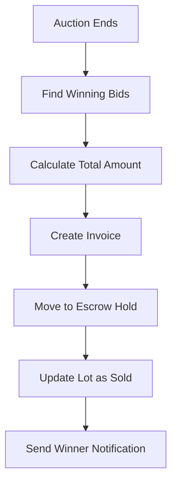
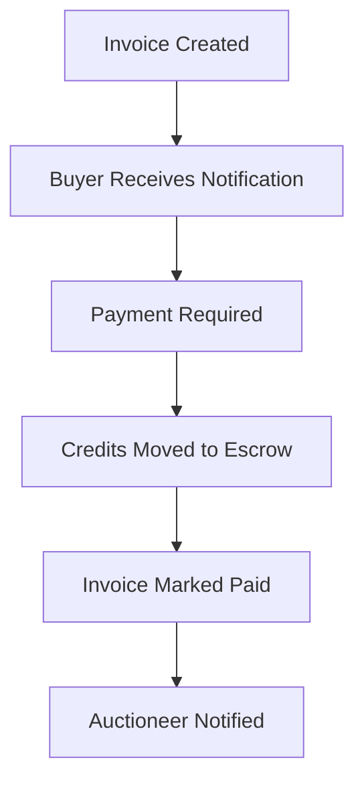
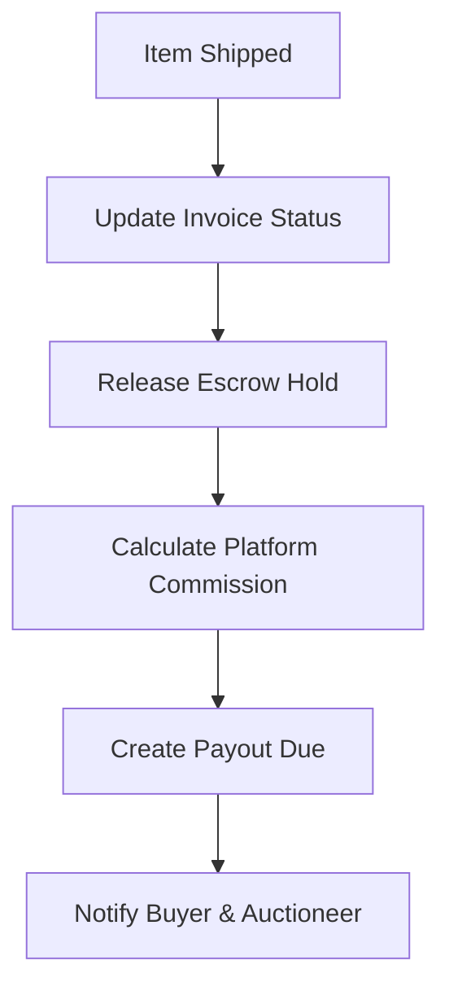

# Invoice & Escrow System Documentation

## Overview

The ImagineThisAuction platform implements a comprehensive escrow system that protects both buyers and sellers throughout the auction completion process. This document describes the complete flow from auction end to final payout.

## System Architecture

### Core Components

1. **Auction End Processing** - Automatically determines winners and creates invoices
2. **Escrow Management** - Holds buyer funds until shipment confirmation
3. **Invoice Management** - Tracks payment status and shipping details
4. **Payout System** - Manages seller payouts after successful delivery
5. **Admin Oversight** - Provides administrative controls for dispute resolution

### Database Tables

- `invoices` - Winner invoices with payment and shipping status
- `payouts_due` - Auctioneer payouts pending distribution
- `wallet_ledger` - Complete transaction history including escrow operations
- `audit_log` - System actions and changes tracking

## Process Flow

### 1. Auction Completion

**Trigger**: When an auction's `ends_at` time passes
**Function**: `process_auction_end(auction_uuid)`



**Process**:
1. Identify all lots with winning bids
2. Calculate hammer price + buyer's premium (default 10%)
3. Create invoice record for each winner
4. Move winning bid amount from `bid_hold` to `escrow_hold`
5. Update lot status to sold with winner information
6. Update auction status to `ended`

### 2. Payment Processing

**Status**: `is_paid = true` indicates funds are held in escrow
**Verification**: Credits are locked in `escrow_hold` transaction type



### 3. Shipping & Escrow Release

**Trigger**: Auctioneer marks item as shipped
**Function**: `release_escrow_on_shipping(invoice_uuid)`



**Process**:
1. Auctioneer marks invoice as shipped (optional tracking number)
2. System releases escrow hold (buyer's credits are spent)
3. Calculate platform commission (1.2% of hammer price)
4. Create payout due record for auctioneer
5. Send shipping confirmation to buyer

### 4. Seller Payout

**Admin Action**: Mark payout as paid with payment reference
**Result**: Complete transaction cycle closure

## API Endpoints

### Auction Management

#### `POST /api/auctions/[id]/close`
Manually close an auction and process all winners.

**Authentication**: Admin or auction owner
**Request**: Empty body
**Response**:
```json
{
  "success": true,
  "message": "Auction closed successfully",
  "processed_lots": [
    {
      "lot_id": "uuid",
      "lot_number": 1,
      "winner_id": "uuid",
      "hammer_price": 2000,
      "invoice_id": "uuid"
    }
  ]
}
```

### Invoice Management

#### `GET /api/invoices`
Retrieve invoices with role-based filtering.

**Parameters**:
- `status`: `pending` | `escrow` | `shipped`
- `shipped`: `true` | `false`
- `paid`: `true` | `false`

**Response**:
```json
{
  "invoices": [
    {
      "id": "uuid",
      "hammer_price": 2000,
      "buyer_premium_amount": 200,
      "total_amount": 2200,
      "is_paid": true,
      "is_shipped": false,
      "lot": {
        "lot_number": 1,
        "title": "Vintage Watch",
        "auction": {
          "title": "Estate Sale",
          "auctioneer": {
            "company_name": "Heritage Auctions"
          }
        }
      },
      "buyer": {
        "first_name": "John",
        "last_name": "Doe",
        "email": "john@example.com"
      }
    }
  ]
}
```

#### `POST /api/invoices/[id]/ship`
Mark an invoice as shipped and release escrow.

**Authentication**: Admin or auction owner
**Request**:
```json
{
  "tracking_number": "1Z999AA1234567890",
  "shipping_notes": "Fragile item, handle with care"
}
```

**Response**:
```json
{
  "success": true,
  "message": "Invoice marked as shipped and escrow released",
  "tracking_number": "1Z999AA1234567890"
}
```

### Payout Management

#### `GET /api/payouts`
Retrieve payouts with role-based filtering.

**Parameters**:
- `status`: `pending` | `paid`

#### `POST /api/payouts`
Mark a payout as paid (Admin only).

**Request**:
```json
{
  "payout_id": "uuid",
  "payment_reference": "ACH-2024-001"
}
```

## User Interfaces

### Bidder Experience

#### Invoice Dashboard (`/invoices`)
- View all won items and their status
- Payment requirements and amounts
- Tracking information for shipped items
- Payment history and receipts

**Status Indicators**:
- 🔴 **Payment Required** - Action needed from buyer
- 🟡 **Paid - Awaiting Shipment** - In escrow, waiting for seller
- 🟢 **Shipped** - Complete, tracking available

### Auctioneer Experience

#### Invoice Management (`/org/invoices`)
- View all sold items requiring action
- Mark items as shipped with tracking
- Revenue tracking and commission breakdown
- Payout status monitoring

**Key Actions**:
- Ship items with tracking numbers
- Add shipping notes for special handling
- View buyer contact information
- Track payout status

### Admin Experience

#### Admin Dashboard (`/admin`)
- Complete system oversight
- Invoice and payout management
- Revenue and commission tracking
- Dispute resolution tools

**Management Capabilities**:
- Force invoice status changes
- Manual payout processing
- Transaction history review
- System health monitoring

## Financial Flow

### Revenue Distribution

For each completed sale:

```
Total Sale = Hammer Price + Buyer's Premium (10%)
Platform Commission = 1.2% of Hammer Price
Auctioneer Payout = Hammer Price - Platform Commission
```

**Example**:
- Hammer Price: $100.00
- Buyer's Premium: $10.00 (10%)
- **Buyer Pays**: $110.00
- Platform Commission: $1.20 (1.2% of hammer)
- **Auctioneer Receives**: $98.80

### Transaction Types

| Type | Description | Balance Impact |
|------|-------------|---------------|
| `purchase` | Credit pack purchase | + Credits |
| `bid_hold` | Active bid placed | - Credits (temporary) |
| `bid_refund` | Outbid refund | + Credits |
| `escrow_hold` | Winning bid locked | No change |
| `escrow_release` | Item shipped | - Credits (final) |
| `payout` | Seller payment | + Credits |

## Security Considerations

### Financial Safety

1. **Atomic Operations** - All escrow operations use database transactions
2. **Idempotency** - Duplicate processing prevention at multiple levels
3. **Audit Trail** - Complete transaction history with references
4. **Access Controls** - Role-based permissions for all operations

### Data Protection

1. **PII Handling** - Minimal personal data in logs
2. **Payment Security** - No payment data stored locally
3. **Access Logs** - All admin actions tracked in audit log
4. **Backup Recovery** - Transaction history enables reconciliation

## Error Handling

### Common Scenarios

1. **Auction End Failures**
   - Network timeouts during processing
   - Insufficient wallet balance (edge case)
   - Database constraint violations

2. **Shipping Confirmation Errors**
   - Invoice already shipped
   - Invalid tracking numbers
   - Permission violations

3. **Payout Processing Issues**
   - Duplicate payout attempts
   - Invalid payment references
   - Auctioneer account problems

### Recovery Procedures

1. **Transaction Rollback** - Database transactions ensure consistency
2. **Manual Override** - Admin tools for edge case resolution
3. **Audit Review** - Complete transaction history for debugging
4. **Customer Support** - Clear error messages and contact options

## Monitoring & Alerts

### Key Metrics

1. **Processing Times**
   - Auction end processing: < 30 seconds
   - Escrow release: < 5 seconds
   - API response times: < 500ms

2. **Success Rates**
   - Auction end success: > 99%
   - Escrow release success: > 99.5%
   - Payment processing: > 98%

3. **Financial Tracking**
   - Total escrow holdings
   - Pending payouts
   - Platform commission revenue

### Alert Conditions

- Failed auction end processing
- Escrow release failures
- Wallet balance discrepancies
- Extended payout delays (>7 days)

## Testing Strategy

### Automated Tests

1. **Unit Tests** - Database functions and API endpoints
2. **Integration Tests** - Complete escrow flow simulation
3. **Load Tests** - High-volume auction processing
4. **Security Tests** - Permission and access validation

### Test Coverage

- ✅ Auction end processing with multiple winners
- ✅ Escrow hold and release operations
- ✅ Invoice creation and status tracking
- ✅ Payout calculation and distribution
- ✅ Error handling and edge cases
- ✅ API endpoint security and validation

## Future Enhancements

### Phase 2 Features

1. **Partial Refunds** - Support for damaged/returned items
2. **Dispute Resolution** - Formal process for buyer/seller disputes
3. **Auto-Shipping** - Integration with shipping APIs
4. **Multi-Currency** - Support for international sales
5. **Installment Payments** - Large purchase payment plans

### Operational Improvements

1. **Real-time Notifications** - WebSocket updates for status changes
2. **Email Templates** - Rich HTML notifications with branding
3. **Mobile Apps** - Native iOS/Android invoice management
4. **Analytics Dashboard** - Advanced revenue and performance metrics
5. **Third-party Integrations** - Accounting software connections

---

## Quick Reference

### Database Functions

- `process_auction_end(auction_uuid)` - Process completed auction
- `release_escrow_on_shipping(invoice_uuid)` - Release funds on shipping
- `get_wallet_balance(user_uuid)` - Calculate current balance
- `add_wallet_credits(user_uuid, amount, event_id, description)` - Add credits

### Key Status Values

**Auction Status**: `draft` → `scheduled` → `live` → `ended` → `completed`
**Invoice Status**: `unpaid` → `paid/escrow` → `shipped/complete`
**Payout Status**: `pending` → `paid`

### Important Notes

- All monetary values stored in cents (integer)
- UTC timestamps for all time-sensitive operations
- Foreign key constraints prevent orphaned records
- RLS policies enforce role-based data access
- Complete audit trail for all financial operations